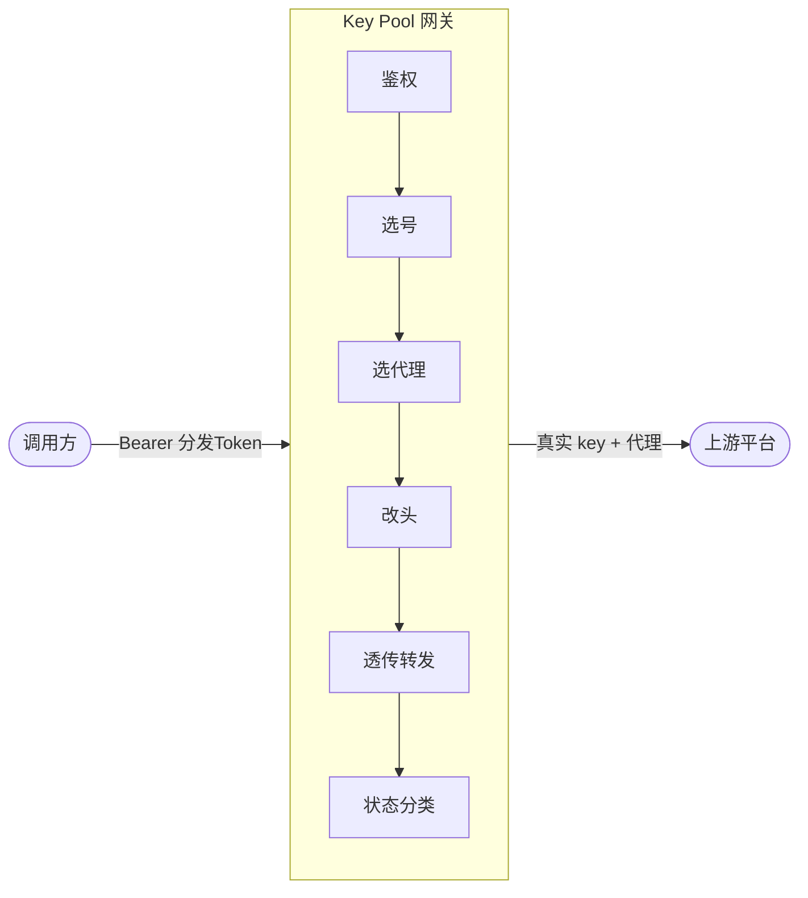
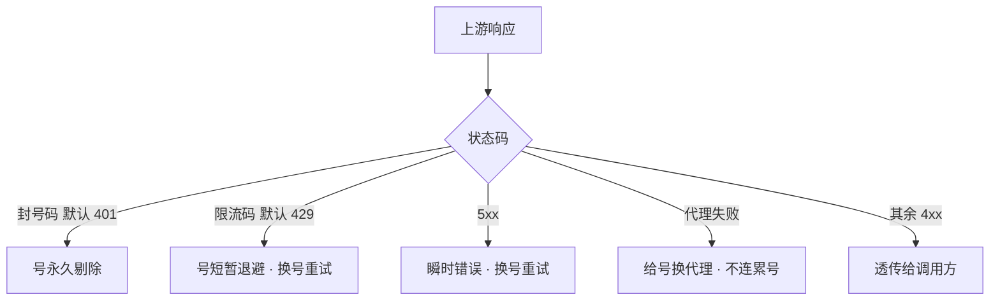

# Research Tool Key Pool

> 多平台搜索 / 爬取 API 的**号池化转发网关** —— 一个地址、一个 Token,内部自动选号、经代理转发、封号剔除、限流重试。

把多个上游平台账号(「号」)聚合成池,对外只暴露**统一的接入地址 + 分发 Token**。调用方完全不接触真实 API key 与代理;网关内部完成:撕分发 Token → 换真实平台 key → 按同 IP 吸附选代理 → 透传到上游 → 按状态码分类(封号永久剔除 / 限流退避重试)。

## 为什么需要

- **保护真实 key**:调用方只拿到分发 Token,真实平台 key 永不外泄;Token 不用了直接删除(硬删除,不留死数据)
- **统一接入**:四个平台、多种认证(Bearer / x-api-key),对外统一 `Authorization: Bearer <分发Token>`
- **代理隔离**:每个号绑定一个代理,同 IP 不连续调用,降低被风控关联
- **高可用**:号池自动调度,某号被封 / 限流自动换号重试,调用方无感
- **透明转发**:除认证头外,请求头 / 请求体 / 编码协商原样透传,不破坏平台原生功能

## 工作原理



一次转发流程:

1. **鉴权** — 校验分发 Token 有效且允许访问目标平台
2. **选号** — 平台号池里按代理占用均衡选号,尽量同 IP 不连续
3. **选代理** — 号绑定的代理(优先吸附注册 IP 的 exit_ip)
4. **改头** — 撕分发 Token,套真实平台认证头,其余请求头原样透传
5. **转发** — 经代理请求上游(每平台独立超时)
6. **状态分类**(详见下图)

**状态分类**(按上游响应码):



## 支持平台

| 平台      | 认证      | 余额查询 | 接入示例                            |
| --------- | --------- | :------: | ----------------------------------- |
| Tavily    | Bearer    |    ✅    | `http://<服务>/tavily/search`       |
| Firecrawl | Bearer    |    ✅    | `http://<服务>/firecrawl/v2/scrape` |
| Exa       | x-api-key |    ❌    | `http://<服务>/exa/search`          |
| Context7  | Bearer    |    ❌    | `http://<服务>/context7/...`        |

新增平台 = 加一个 `PlatformAdapter` 实现 + 注册,调度逻辑不变。

## 快速开始

### Docker

```bash
docker run -d --name keypool \
  -p 8787:8787 \
  -v ./data:/app/data \
  -v ./config.toml:/app/config.toml \
  ghcr.io/arsonist-g/research-tool-key-pool:latest
```

打开 `http://localhost:8787`;管理员账号在 `config.toml` 的 `admin_user` / `admin_password`(没配则首次启动随机生成,见 `docker logs keypool`)。

> **首次启动**:不挂载 `config.toml` 会自动生成随机密钥的配置;**生产环境必须持久化** `config.toml` 与 `/app/data`,否则密钥丢失将无法解密库内已加密的真实 key。

**镜像标签**:`:latest`(最新)与 `:<短SHA>`(每次 push 的版本),支持 `linux/amd64` 与 `linux/arm64`。

### docker-compose

仓库根目录有 `docker-compose.yaml`,直接:

```bash
docker compose up -d
```

### 从源码构建

```bash
cargo run              # debug 模式,前端 live reload(改 frontend/ 无需重启)
cargo build --release  # release 模式,前端编译进二进制
./target/release/research-tool-key-pool
```

## 配置

### config.toml(首次启动自动生成)

| 字段                 | 默认                              | 说明                                                               |
| -------------------- | --------------------------------- | ------------------------------------------------------------------ |
| `listen`             | `0.0.0.0:8787`                    | 监听地址                                                           |
| `database_url`       | `sqlite:data/keypool.db?mode=rwc` | SQLite 路径                                                        |
| `master_key`         | 随机                              | AES-256 主密钥,加密号池里真实 API key;**泄露则库内 key 可被解出**  |
| `session_secret`     | 随机                              | 管理员会话 cookie(`kp_session`)的 HMAC 签名密钥;**泄露可伪造会话** |
| `admin_key`          | 随机                              | 管理 API 自动化鉴权(`X-Admin-Key` 头),见下方「管理 API」           |
| `sync_interval_secs` | `300`                             | 代理组同步间隔(秒),运行时可在线改                                  |
| `log_max_mb`         | `100`                             | 调用日志最大占用 MB,超过删最旧                                     |
| `admin_user`         | 可选                              | 管理员用户名;**填了则最高优先级,每次启动覆盖 DB**                  |
| `admin_password`     | 可选                              | 管理员密码;同上                                                    |

> **管理员账号**(两种方式):
>
> - **在 `config.toml` 填 `admin_user` + `admin_password`** → 最高优先级,每次启动覆盖数据库(改这里 + 重启容器即生效;忘密码看挂载的 config 即可恢复)
> - **不填** → 首次启动**随机生成密码并打印到日志**(`docker logs keypool`),之后存库

### 运行时可调(管理后台「设置」页,在线改、下次循环生效)

代理组同步间隔 · 余额同步间隔(仅查近期调用过的号)· 转发重试上限 · 单号并发上限 · 调用日志最大占用 MB

**上游超时**:在各平台页**按平台单独配置**(默认 120s;长任务如 Tavily crawl 调到 150s)。

### 每平台可配(管理后台「平台」页)

绑定代理组(多选)· 并发上限 · 封号码(默认 401)· 限流码(默认 429)· 上游超时 · 同 IP 不连续调用 · 额度上限(仅不支持余额查询的平台)

## 使用

### 管理员四步

1. **平台** — 配置各平台封号 / 限流码、上游超时、并发、绑定代理组
2. **代理** — 新建代理组(组名 + easy_proxies 完整订阅链接),同步得到代理池
3. **号池** — 上传各平台真实 key(每行一个,可在 key 后加 `,注册IP`);号自动绑定代理
4. **分发 Token** — 新建 Token,勾选授权平台 → 弹窗给出接入地址 + curl 示例(含明文 Token,仅展示一次)

### 调用方

把原 API 文档里的 base URL 换成接入地址,路径不变,认证改用分发 Token:

```bash
# 原 Tavily 调用(真实 key)
curl -X POST https://api.tavily.com/search \
  -H "Authorization: Bearer <真实key>" \
  -d '{"query":"...","max_results":5}'

# 经网关(替换 base URL + 认证即可,请求体完全一致)
curl -X POST http://<服务地址>/tavily/search \
  -H "Authorization: Bearer <分发Token>" \
  -d '{"query":"...","max_results":5}'
```

请求体与原平台 API 完全一致;所有平台认证统一为 `Authorization: Bearer <分发Token>`。

## 管理 API

| 用途                                     | 路径                          | 鉴权                                |
| ---------------------------------------- | ----------------------------- | ----------------------------------- |
| 登录                                     | `POST /api/v1/admin/login`    | —                                   |
| 平台 / 号 / 代理组 / Token / 日志 / 设置 | `/api/v1/admin/*`             | 会话 cookie 或 `X-Admin-Key` 头     |
| **转发**                                 | `POST /{platform}/{endpoint}` | `Authorization: Bearer <分发Token>` |

**`X-Admin-Key`(自动化鉴权)**:值 = `config.toml` 的 `admin_key`,用于脚本 / CI 等无浏览器场景调 `/api/v1/admin/*`(平台 / 号 / 代理组 / Token / 日志 / 设置 CRUD),替代登录会话。例外:改密码、查自己信息需浏览器登录(真实会话)。

```bash
curl -H "X-Admin-Key: admin_xxx" http://localhost:8787/api/v1/admin/platforms
# 例如脚本批量上传号:
curl -X POST http://localhost:8787/api/v1/admin/platforms/tavily/accounts \
  -H "X-Admin-Key: admin_xxx" -H "Content-Type: application/json" \
  -d '{"accounts":[{"api_key":"tvly-..."}]}'
```

## 开发

**技术栈**:Rust(axum 0.8 + sqlx/SQLite + reqwest 0.13)+ Alpine.js 3(独立 HTML,rust-embed 内嵌)

```bash
cargo run      # debug:前端 live reload,改 frontend/ 无需重启
cargo test     # 单元测试(adapter / crypto / auth / scheduler)
```

### 项目结构

```
src/
  main.rs          路由 + 启动
  config.rs        配置加载
  db.rs            schema + 迁移 + 种子
  adapter.rs       平台适配 trait + 四平台 impl + Registry
  scheduler.rs     调度转发引擎(选号 / 选代理 / 状态分类 / 重试)
  sync.rs          代理同步 / 余额同步 / 日志清理
  api_forward.rs   透明转发 handler
  api_admin.rs     管理 API
  auth.rs          鉴权(会话 / 管理 key / 分发 token)
  pools.rs         内存索引 + 并发信号量
  crypto.rs        AES-256-GCM + SHA-256
  embed.rs         前端静态资源(rust-embed)
frontend/          管理后台页面(Alpine.js)
```
